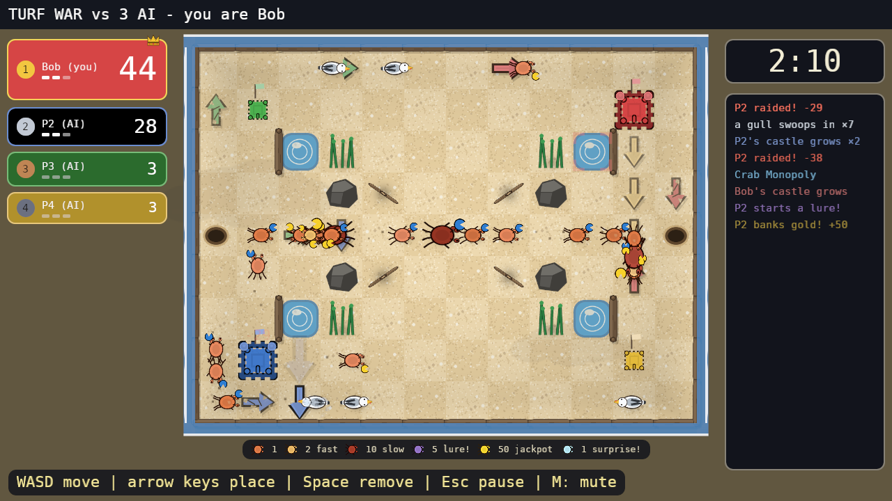
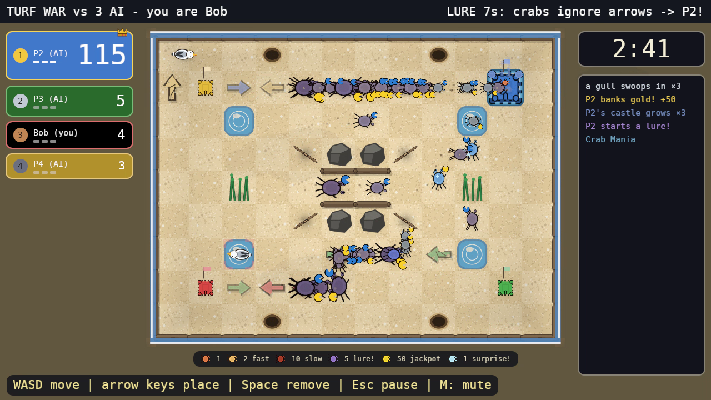
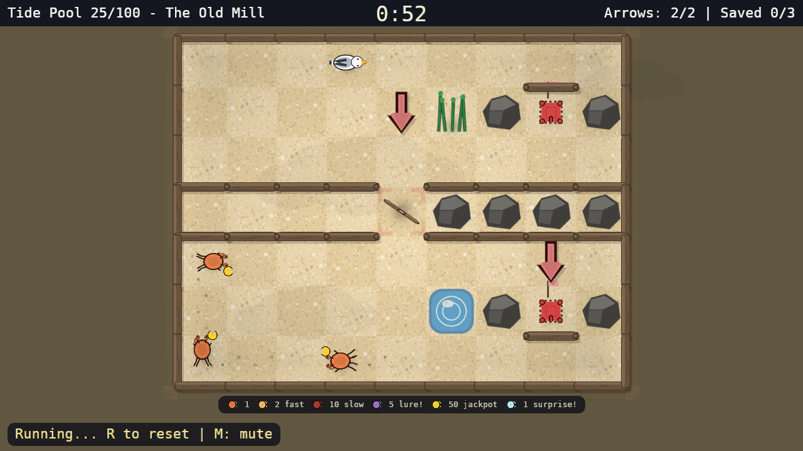
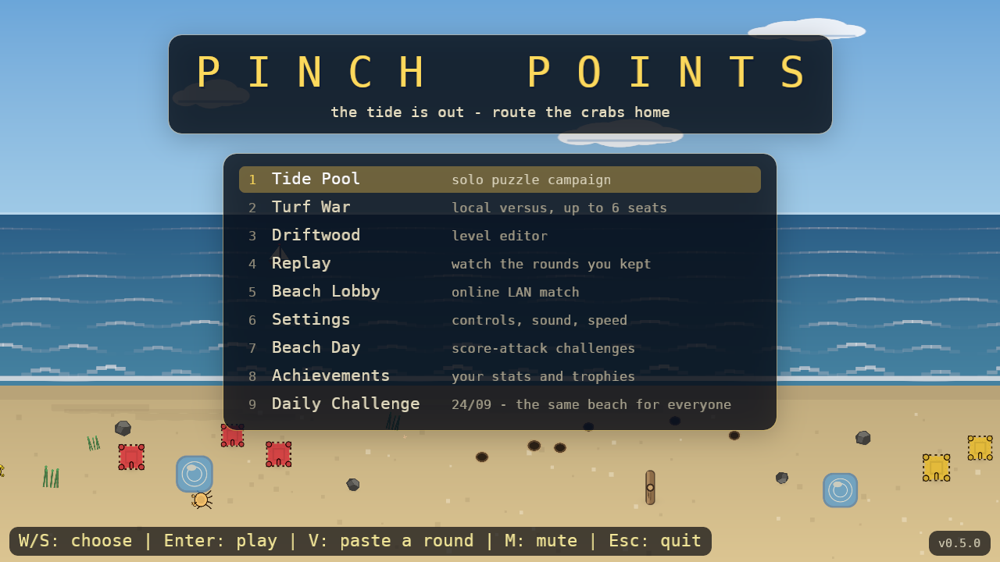
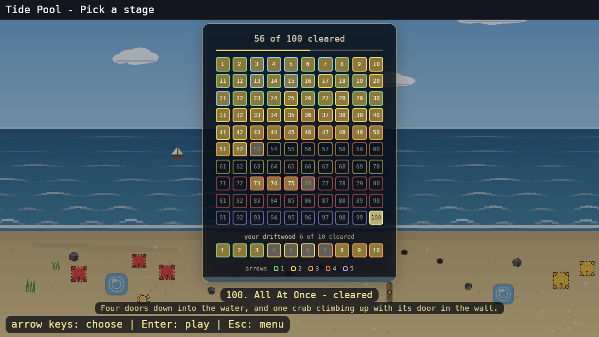

# Pinch Points 🦀

[](https://github.com/agourlay/pinch-points/actions/workflows/ci.yml)
[](https://crates.io/crates/pinch-points)

A fast, kid-friendly crab-routing game for 1-6 players, built in Rust with
[Bevy](https://bevyengine.org). The tide is out: place arrows in the sand
to route streams of crabs into your castle before the sea (and the gulls)
take everything back.



## How to install

Pick whichever suits you:

- **Prebuilt binaries** for Linux, macOS and Windows (x86_64 and arm64) are
  attached to each [GitHub release](https://github.com/agourlay/pinch-points/releases).
  Unpack the archive and run `pinch-points`.
- **From crates.io** with a Rust toolchain installed:
  ```sh
  cargo install --locked pinch-points
  ```
  (`--locked` builds against the dependency versions this game was tested
  and released with, rather than re-resolving to whatever is newest.)
  ([crates.io/crates/pinch-points](https://crates.io/crates/pinch-points))
- **From source**, in release mode:
  ```sh
  git clone https://github.com/agourlay/pinch-points
  cd pinch-points
  cargo build --release
  ./target/release/pinch-points
  ```

The last two need Bevy's Linux build dependencies (`libudev-dev`,
`libasound2-dev`, `libwayland-dev` or X11 equivalents); see
[Building & running](#building--running).

## Lineage

Pinch Points is built on the mechanical skeleton of Sonic Team's **ChuChu
Rocket!** (1999):

| ChuChu Rocket | Pinch Points |
|---|---|
| Mice (ChuChus) | Crabs |
| Cats (KapuKapus) | Gulls |
| Rockets | Sandcastles |
| Arrow panels | Arrows |
| "?" roulette specials | Tide events |
| Cat Mania / Mouse Mania | Gull Mania / Crab Mania |
| Stage Challenge | Beach Day |
| Wrap-around edges | Open-ocean levels |

Inherited: creatures walk forward and turn at walls by a fixed rule, arrows
are the player's only verb, everyone places simultaneously in versus, and
steering the predator is as much fun as steering the prey.

## What's different

**Six players, not four**, at four corner castles plus two mid-edge on the
wider generated arenas. Team play grows with the table: 2v2 at four, 2v2v2
or 3v3 at six.

**Every crab has a handedness.** The original's turn rule is global; here
left-clawed crabs try left first and right-clawed right, with the oversized
claw as the tell. One bit of state that turns herding puzzles into *sorting*
ones: the same corridor routes two crabs to two destinations.

**The score is on the board.** Castles grow through four tiers as they
bank; the HUD is the redundancy, not the readout.

**A raid costs half, and hands some back.** A gull carries off half the
castle's bank, spills live crabs onto the sand for everyone to scramble
over, and leaves with its loot: a raid drains the flock instead of
compounding it.

**The tide, instead of a rocket launch.** The sea closing in around the
board is the visible clock. The last 30 seconds double the gull spawn rate;
the wave stops everything where it stands.

Plus terrain and a crab bestiary the original never had (both below), AI
that walks a cursor to the tile the way you do, replays shareable as text
codes (even a round *in progress*), a daily challenge that needs no server
because the sim is deterministic, and an editor whose solver proves a level
beatable before it ships.

## Rules

**The sand.** A walled grid. Crabs and gulls walk forward; at a wall they
turn toward their claw side, then the other side, then back the way they
came.

**Arrows.** Your one verb: every creature crossing one turns that way.
In versus you may have **3** standing (a fourth replaces your oldest), each
washes away after ~10 seconds, and two gull crossings destroy one.

**Crabs** stream out of spawner holes and are banked by walking into any
castle. By value/speed: common (1), juvenile (2, fast), giant (10, slow),
molting (5; banking one **lures every loose crab toward your castle for
10 s, overriding all arrows**), golden (50, rare), and sparkling
(banking one spins the **tide event** roulette: crab/gull manias, speed
shifts, castle swaps, fresh sand…).

**Gulls** eat crabs on contact and are steerable: aiming them at a rival's
castle is the entire offensive game. A gull reaching a castle **carries off
half its bank** and departs. Gulls occasionally take flight for a few
tiles, ignoring walls and arrows, so no corner is ever fully safe.

**Castles are the scoreboard**, flanked by a ranked leaderboard on the left
(the leader's card is biggest and wears the crown) and the tide clock over
a live event feed on the right. Round-changing moments (a lure, a tide
event, the gull surge) are also announced across the centre of the screen.



**The tide.** The clock turns red for the last 30 seconds, the gull surge
doubles, and the music speeds up; when the tide comes in, the highest bank
wins.

**Terrain.**



- **Turnstile log**: deflects each crossing creature right or left,
  alternating: a deterministic 50/50 splitter.
- **Kelp**: crabs slip through; gulls can neither walk nor land in it.
  Build gull-proof supply lanes.
- **Tide pools**: shallow water; wading halves your speed.

## Modes



- **Tide Pool**: an 82-level solo puzzle campaign with a fixed arrow
  inventory. The test suite proves every level solvable with the arrows
  given, and every level that needs an arrow unsolvable without them (the
  opening tutorial hands you one to practise with on a board that cannot
  lose).
- **Turf War**: local versus for **2-6 players** on one keyboard plus
  gamepads. Six built-in maps, from the handcrafted classic beach to
  generated arenas up to 20×13 and an edgeless **open ocean** (five and
  six seats need one of the wide beaches, 16 tiles across or more), plus
  any beach you built yourself that has a castle for every seat. Dials for gull
  pressure and round length, **team play**, a **best of 5** series with
  rotating maps, nameable seats, and rounds you can **put down mid-play**
  and pick up later exactly where they stood. AI comes at three levels:
  easy fumbles, fierce reads the terrain and shoves gulls at the leader,
  and every AI walks a cursor at a capped speed rather than reaching
  across the board for free (`cargo run --example ladder` plays them off).
- **Beach Day**: eight score-attack challenge stages (timed goals, versus
  rules).
- **Driftwood**: a level editor with a built-in solver, playtesting, and
  save-to-campaign. `F1` names the level, `F5` cycles the beach size
  (up to 20×13), and `F2` files it under its name, so saving is keeping
  rather than replacing. Saved levels appear at the end of the Tide Pool
  stage list, unlocked, and can be picked as a versus beach.

  "Validate" searches under the same budget the campaign ships to, and a
  level's cost is the tiles its crabs cross rather than the size of its
  beach: a big beach with a compact puzzle in it validates, one filled
  edge to edge may be beatable and still take longer than the solver is
  allowed.
- **Beach Lobby**: online play for up to 6 over LAN: deterministic UDP
  lockstep, host-relay star, state-hash desync detection. You name yourself
  before hosting or joining and the host names the beach, so a hall running
  many games at once can tell who from which. Hosts announce once a second
  and the lobby lists every beach it can hear with how full it is: arrows
  pick, Enter joins, `1`-`9` are shortcuts. The list sorts stably, scrolls,
  and the cursor holds the beach it named rather than the row, so a game
  vanishing never moves your finger onto someone else's. The host's match
  setup travels with the invitation, **AI seats** included, and every player
  joins under their P1 name, so the leaderboard reads the same on every
  machine. A beach the host built travels whole; every other map is a seed
  both machines build from.

  `T` sends a short line to the lobby, relayed by the host.

  A match that has begun stays listed as **in progress**. Lockstep replays
  from frame zero, so there is nothing to catch a latecomer up with: you
  cannot join, but you can **queue** for the host's next round, or press
  **W** to spectate, which has to happen before launch.

  Discovery is a UDP broadcast to `255.255.255.255` on ports 47700-47707,
  so every machine has to share a broadcast domain: a router between two
  subnets, or the client isolation most guest wireless turns on, will hide
  hosts from each other. When the network will not cooperate, a direct
  pair skips discovery entirely: `PINCH_HOST=<port>` on one machine and
  `PINCH_JOIN=ip:port` on the other boot both straight into the arena, with
  the host as player 0 and the joiner as player 1. There is no lobby to
  agree the terms, so `PINCH_BOTS=<n>` (AI seats behind the two humans)
  has to be set identically on both sides.
- **Replay**: every finished round is kept in a library and watchable at
  1x/2x/4x. `C` copies a round as a checksummed **share code**, `V` pastes
  one back, including a Turf War round *in progress*, which `V` on the
  menu drops you into mid-play. The editor shares levels the same way
  (`F3`/`F4`).
- **Daily Challenge**: one date-seeded arena per day, identical worldwide,
  with a local best.
- **Achievements**: thirty-two trophies and lifetime stats.



## Controls

| | Move | Place | Remove | Clear all |
|---|---|---|---|---|
| P1 | WASD | arrow keys | Space | Shift |
| P2 | IJKL | numpad 8/5/4/6 | numpad 0 | numpad Enter |
| any seat | gamepad d-pad/stick | face buttons | L1 | R1 |

Pads are plug-and-play and fill seats from the highest player down, which
makes keyboard-plus-pad, two pads and two keyboards all work with no setup
at all; P1 and P2 can each say otherwise and name a controller of their
own. Every menu is navigable from a pad, and Start on the match-setup
screen joins the next seat. `M` toggles music, and `Esc` on the menu
quits.

Settings is grouped into controls, sound, the round, presentation and the
game itself: what plays each of the first two seats, per-key rebinding, a
single-hand preset, cursor tuning, puzzle speed assist, rumble and
deadzone, versus scoring, how many finished rounds the shelf keeps, a
colour-vision-safe palette, UI scaling, reduced motion, the update check,
a progress reset, and the UI language: **English, Français, Deutsch,
Español, Italiano, Nederlands, Русский, 日本語**, each with its flag beside
it on the dial.

Every screen is translated, down to the level names and the teaching
hints. Japanese is drawn in a face of its own, a subset of Noto Sans Mono
CJK JP cut to the characters the game says; the text stack reaches for it
a script at a time, so a prompt that is half kanji and half `WASD` comes
out in both.

On start-up the game asks GitHub, off-thread, whether a newer release is
out. If one is, the menu steps onto a page of its own: the new version's
number, its release notes, and one question - yes opens the release page in
the browser, no goes back to the menu until next time. It is the one thing
the game says to the wider internet, so it is a setting (on by default), and
a machine with no network, or a slow one, gives up inside a few seconds. The
menu's bottom-right corner shows the running version, which is the number
the page compares against.

A fresh install opens on the language list rather than on a menu in a
language nobody chose: eight flags, with the header and prompt rewriting
themselves as the cursor moves, so the right one can be recognised without
reading the others. Enter takes it; the picker appears on the absence of a
settings file and on nothing else.

The window is resizable and the interface scales with it, so the whole
game fits whatever it is dragged to.

## Building & running

```sh
cargo run --release
```

Requires Rust (2024 edition) and Bevy's Linux dependencies (`libudev-dev`,
`libasound2-dev`, `libwayland-dev` or X11 equivalents). Assets are
committed, embedded into the binary at build time, and regenerated by
`tools/gen_sprites.py`, `tools/gen_flags.py` (the language chips),
`tools/gen_jp_font.py` (the Japanese face, cut down to the characters the
game says) and `tools/gen_sounds.py` (which needs `ffmpeg` for the music
loops).

### Determinism

The simulation is engine-free, integer-only, and bit-reproducible, which
lets lockstep netcode, replays, and the solver share one implementation.
`tests/it/determinism.rs` pins a state-hash anchor: a behavior-neutral
refactor must leave it untouched; a rules change re-derives it
deliberately.

### Tooling

- `cargo run --example author -- levels/<file>.txt`: the level design loop;
  reports whether a level self-solves and what the solver finds.
- `cargo run --release --example verify_levels`: the campaign minimality
  proof — every shipped level must need every arrow it grants. A parallel,
  exhaustive-per-level solver search (a minute in release, so run it in
  release, not in CI), with a progress bar; exits non-zero naming any level
  with an arrow to spare. Run it by hand after editing a level file.
- `PINCH_*` env hooks skip the menus for development and testing:
  `PINCH_SKIRMISH=classic|large|xl|ocean|custom` boots a bots match
  (`PINCH_SERIES=1` for a best-of-5, `PINCH_SEATS=<n>` for the table,
  `PINCH_BOTS=<n>` for AI seats), and `PINCH_SANDBOX`,
  `PINCH_AUTOPLAY=<level>`, `PINCH_EDITOR`, `PINCH_MATCH`, `PINCH_REPLAY`,
  `PINCH_LIBRARY`, `PINCH_RESUME`, `PINCH_ACHIEVEMENTS`, `PINCH_SETTINGS`,
  `PINCH_CONTROLS`, `PINCH_STAGES=tide|beach`, and
  `PINCH_LOBBY_HOST`/`PINCH_LOBBY_JOIN`/`PINCH_LOBBY_WATCH` open the rest.
  `PINCH_BANNER=lure|surge|<0-7>` raises an announcement and
  `PINCH_TIDE=<0-7>` fires the tide event itself, which is how what an
  event *does* gets watched. `PINCH_WINDOW=<w>x<h>` opens at a given size,
  for checking a screen at the sizes people drag a window to, and
  `PINCH_SCREENSHOT=<path>` with `PINCH_SCREENSHOT_AT=<seconds>` took every
  picture in this file. `PINCH_NO_UPDATE` skips the
  release check for a run and `PINCH_UPDATE_DEMO` opens the new-version page
  for a made-up release, to look at it without waiting for a real one.
- `docs/backlog.md` tracks the remaining ideas and review findings.

The design document lives in `docs/pinch-points-spec.md`.

## License

[Apache-2.0](LICENSE).
