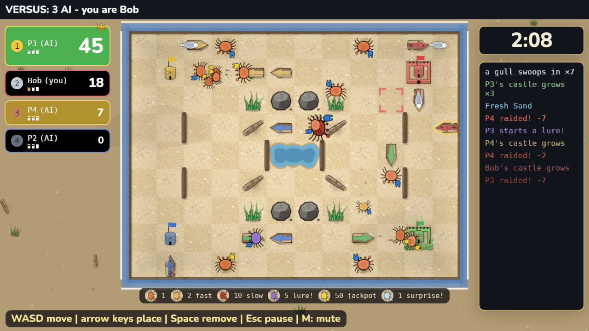

# Pinch Points 🦀

[](https://github.com/agourlay/pinch-points/actions/workflows/ci.yml)
[](https://crates.io/crates/pinch-points)

A fast, kid-friendly crab-routing game for 1-6 players, built in Rust with
[Bevy](https://bevyengine.org). The tide is out: place arrows in the sand
to route streams of crabs into your castle before the sea (and the gulls)
take everything back.



## Install

- **One line**, fetching the latest release for your machine:
  ```sh
  # Linux, macOS
  curl -fsSL https://agourlay.github.io/pinch-points/install.sh | sh
  # Windows (PowerShell)
  irm https://raw.githubusercontent.com/agourlay/pinch-points/master/site/install.ps1 | iex
  ```
- **Prebuilt binaries** for Linux, macOS and Windows (x86_64 and arm64) are
  attached to each [GitHub release](https://github.com/agourlay/pinch-points/releases).
  Unpack the archive and run `pinch-points`.
- **From crates.io**, with a Rust toolchain:
  ```sh
  cargo install --locked pinch-points
  ```
  `--locked` builds against the dependency versions this game was tested
  and released with.
- **From source**:
  ```sh
  git clone https://github.com/agourlay/pinch-points
  cd pinch-points
  cargo build --release && ./target/release/pinch-points
  ```

The last two need Bevy's Linux build dependencies (`libudev-dev`,
`libasound2-dev`, `libwayland-dev` or X11 equivalents).

## The game

Built on the skeleton of Sonic Team's **ChuChu Rocket!** (1999): creatures
walk forward and turn at walls by a fixed rule, arrows are your only verb,
and everyone places at once. What it does differently:

- **Six players**, not four, with team play that grows with the table.
- **Every crab has a handedness**, left-clawed or right, so one corridor
  can route two crabs to two destinations. Herding puzzles become sorting
  ones.
- **The score is on the board**: castles grow through four tiers as they
  score.
- **A gull raid costs half a castle** and spills live crabs back onto the
  sand for everyone to scramble over.
- **The tide is the clock.** The last 30 seconds double the gull spawn
  rate; the wave stops everything where it stands.

Plus terrain and a crab bestiary the original never had, AI that walks a
cursor to the tile the way you do, and rounds shareable as text codes, even
one still in progress.

## Modes

- **Campaign**: a 100-level solo puzzle campaign, every level proved
  solvable with the arrows it grants and unsolvable without them.
- **Versus**: local versus for 2-6 on one keyboard plus gamepads, with
  team play, series, and AI at three levels.
- **Multiplayer**: up to 6 over LAN, on deterministic lockstep with
  desync detection. Anyone past the sixth chair watches instead,
  and can talk to the table and vote on a random event to call down on it.
- **Level Editor**: a level editor whose solver proves a level beatable
  before it ships.
- **Challenges**, **Replay**, **Daily Challenge**, **Achievements**.

## Bots

Write your own bot, in any language, and play it against the game's AI,
against other people's bots, or beside your friends. A bot is a program
you run yourself that connects to the game over TCP and answers each
tick with a move; the game never runs anyone's code.

```
$ pinch-points arena --seat ai:easy --open 1
Waiting for 1 bot. Start it with:

  pinch://127.0.0.1:47710/H4TN-C2LV

$ python3 bots/python/greedy.py pinch://127.0.0.1:47710/H4TN-C2LV
```

`pinch-points cup serve` runs a competition between bots, `pinch-points
watch FILE` plays any replay in the game, and a bot can take a seat on
the couch or join a LAN party. The protocol, the clocks and every
command are in [`docs/bot-protocol.md`](docs/bot-protocol.md), and
[`bots/python/greedy.py`](bots/python/greedy.py) is a whole bot in one
file to start from.

## Controls

| | Move | Place | Remove | Clear all |
|---|---|---|---|---|
| P1 | WASD | arrow keys | Space | Left Shift |
| P2 | IJKL | numpad 8/5/4/6 | numpad 0 | numpad Enter |
| any seat | gamepad d-pad/stick | face buttons | L1 | R1 |

Pads are plug-and-play and fill seats from the highest player down, so
keyboard-plus-pad, two pads and two keyboards all work with no setup. Every
menu is navigable from a pad, and the interface speaks eight languages.

## Documentation

- [pinch-points on the web](https://agourlay.github.io/pinch-points/): the
  landing page, built from [`site/`](site/).
- [`docs/guide.md`](docs/guide.md): the full guide. Rules, every mode in
  depth, all the controls and settings, LAN troubleshooting, and the
  development hooks.
- [`docs/pinch-points-spec.md`](docs/pinch-points-spec.md): the design
  document.
- [`docs/bot-protocol.md`](docs/bot-protocol.md): writing a bot, and
  [`docs/bot-seats.md`](docs/bot-seats.md), the design behind it.
- [`docs/backlog.md`](docs/backlog.md): remaining ideas.

## Building

```sh
cargo run --release
```

Requires Rust (2024 edition) and the Linux dependencies above. The
simulation is engine-free, integer-only and bit-reproducible, which is what
lets lockstep netcode, replays and the solver share one implementation. See
the [guide](docs/guide.md#building-and-running) for asset regeneration,
determinism and tooling.

## License

[Apache-2.0](LICENSE).
